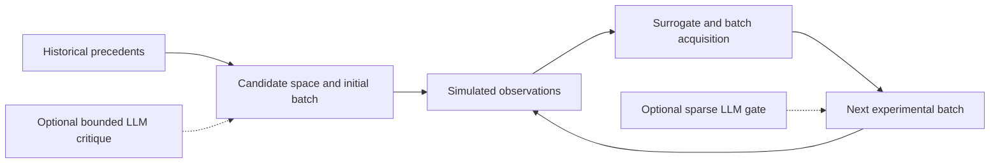

# HTE-Agent

**Two-stage reaction-condition optimization with bounded language-model assistance.**

HTE-Agent combines precedent-based initialization and batch Bayesian optimization for
Buchwald–Hartwig reaction-condition search. Optional language-model modules critique
precedents and adjust a small set of candidates near the batch-selection boundary.

**The included benchmark uses an offline simulator. Its yield and regret values are
simulation results, not new laboratory measurements.**



## Quick start

Use Python 3.11 or later. The offline optimizer uses the Python standard library.

```bash
python -m pipeline_v2.run_frontier_backbone
```

This runs the smoke and small-validation protocols. Results are written under `results/`,
including selected conditions, per-round observations, candidate scores, and summaries.
No API credentials or network connections are needed for the baseline.

For the complete baseline benchmark:

```bash
python -m pipeline_v2.run_frontier_backbone_final_benchmark
```

## Design

- **Stage 1:** retrieve relevant precedents, construct feasible candidates, score transfer
  signals, and select the initial batch.
- **Stage 2:** fit a surrogate, apply an acquisition score and diversity constraints, and
  evaluate new batches.
- **Optional LLM assistance:** bounded Stage 1 corrections and sparse Stage 2 candidate
  adjustments. The optimizer remains responsible for batch construction.

The final benchmark evaluates three reaction profiles and six random seeds per profile.
Each profile run uses 120 simulated observations from a candidate pool capped at 1,200.

## Saved benchmark

Results below are from the distributed
[`benchmarks/final_benchmark_overall_summary.csv`](benchmarks/final_benchmark_overall_summary.csv).
Each configuration contains 18 profile runs.

| Configuration | Best observed mean | Oracle regret | Cumulative regret | Stage 2 batch mean |
| --- | ---: | ---: | ---: | ---: |
| Optimizer baseline | 0.7921 | 0.0013 | 25.4243 | 0.6251 |
| LLM Stage 1 | 0.7921 | 0.0013 | 25.4529 | 0.6246 |
| LLM Stage 2 | 0.7921 | 0.0013 | 25.4139 | 0.6256 |
| LLM Stage 1 + 2 | 0.7921 | 0.0013 | 25.1099 | 0.6255 |

All four configurations tie on final best-observed yield and oracle regret. Differences
appear in search-process metrics and depend on the reaction profile. These results do
not establish a general advantage for LLM-assisted optimization or transfer to wet-lab yields.

## Enable model assistance

Supply your own OpenRouter credential through the environment:

```powershell
$env:OPENROUTER_API_KEY = "<your-credential>"
python -m pipeline_v2.run_frontier_backbone_llm_s2
```

On macOS or Linux, set the same variable with your shell's environment command.
The runner does not load `.env` automatically. Model requests incur provider charges.
Inspect model choices in `pipeline_v2/config.py` before enabling them. A missing credential
is recorded as `missing_api_key`; it must not be interpreted as a successful LLM evaluation.

## Code map

| Location | Purpose |
| --- | --- |
| `pipeline_v2/stage1/` | Precedent retrieval, constraints, and initialization |
| `pipeline_v2/stage2/` | Surrogate optimization, trust regions, and batch selection |
| `pipeline_v2/llm_modules/` | Optional structured critique and candidate gating |
| `pipeline_v2/shared/offline_simulator.py` | Reproducible synthetic response function |
| `data/` | Input precedent tables |
| `benchmarks/` | Saved comparison tables |

The response function combines predefined condition effects, profile-specific interactions,
and deterministic seeded noise. This makes it suitable for testing optimization behavior;
the benchmark alone cannot validate chemical predictions.

## Tests

```bash
python -m pip install -r requirements-dev.txt
python -m pytest
```
