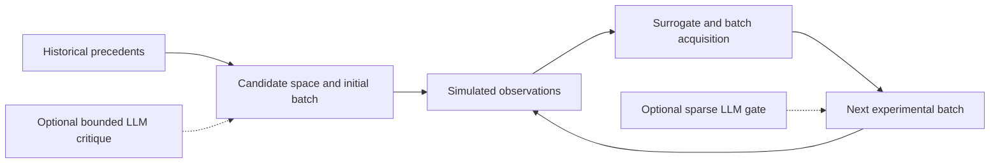

# HTE-Agent

**Two-stage reaction-condition optimization with bounded language-model assistance.**

HTE-Agent combines precedent-based initialization and surrogate-based batch optimization for
Buchwald–Hartwig reaction-condition search. Optional language-model modules critique
precedents and adjust a small set of candidates near the batch-selection boundary.

**The included benchmark uses an offline simulator. Its yield and regret values are
simulation results, not new laboratory measurements.**



## Quick start

Use Python 3.11 or later from a source checkout. The offline optimizer uses the Python
standard library. Optional editable installation: `python -m pip install -e .`
(the chemistry CSVs remain in the checkout; they are not bundled into a wheel).

```bash
python -m hte_agent.run --mode baseline --protocol smoke --offline
```

This runs one smoke profile with network access blocked. Results are written under `results/`,
including selected conditions, per-round observations, candidate scores, and summaries.
No API credentials or network connections are needed for the baseline.

For the complete baseline benchmark:

```bash
python -m hte_agent.run --mode baseline --protocol benchmark --offline
```

Modes are `baseline`, `llm-s1`, `llm-s2`, and `llm-s1s2`. Protocols are `smoke`
(one profile, seed 7), `validation` (two profiles, seed 11), `quick-benchmark`
(three profiles, seeds 17 and 23), and `benchmark` (three profiles, six seeds).
Smoke/validation use 96 initial observations plus one batch of 12; both benchmark
protocols use two batches of 12. `--results-root` selects the output directory.
Add `--aggregate` to explicitly build comparison CSVs for that protocol; ordinary
runs only produce their own outputs. Aggregation separates LLM evaluation statuses.

## Design

- **Stage 1:** retrieve relevant precedents, construct feasible candidates, score transfer
  signals, and select the initial batch.
- **Stage 2:** fit a surrogate, apply an acquisition score and diversity constraints, and
  evaluate new batches.
- **Optional LLM assistance:** bounded Stage 1 corrections and sparse Stage 2 candidate
  adjustments. The optimizer remains responsible for batch construction.

The surrogate combines similarity-weighted local regression, local variance and
novelty-based uncertainty, with trust-region bonuses and diversity-aware selection.
It does not compute a Bayesian posterior; `predicted_std` is a heuristic uncertainty
score. The baseline includes deterministic condition priors and feasibility rules.

The benchmark protocol evaluates three reaction profiles and six random seeds per profile.
Each profile run uses 120 simulated observations from a candidate pool capped at 1,200.

## Saved benchmark

Results below are from the distributed
[`benchmarks/final_benchmark_overall_summary.csv`](benchmarks/final_benchmark_overall_summary.csv).
Each configuration contains 18 profile runs. **This is a legacy snapshot, not an
evaluation of the corrected current assistance semantics.** Historical Stage 1
merged model actions with hard-coded domain recommendations before calibration
(`success_with_backstop_calibrated`). The legacy Stage 2 summarizer also filled
empty model fields with deterministic recommendations. These treatments do not
isolate LLM contributions. The original numbers, filenames and flow identifiers
are preserved; [metadata](benchmarks/metadata.json) records the protocol, hashes,
semantics and provenance. Matching local artifacts record `openai/gpt-4.1-mini`
for all three model roles; the provider-returned model ID/backend revision was
not preserved. No model experiments were rerun for this cleanup.

| Configuration | Best observed mean | Oracle regret | Cumulative regret | Stage 2 batch mean |
| --- | ---: | ---: | ---: | ---: |
| Optimizer baseline | 0.7921 | 0.0013 | 25.4243 | 0.6251 |
| Legacy LLM Stage 1 + backstop | 0.7921 | 0.0013 | 25.4529 | 0.6246 |
| Legacy LLM Stage 2 | 0.7921 | 0.0013 | 25.4139 | 0.6256 |
| Legacy LLM Stage 1 + 2 + backstop | 0.7921 | 0.0013 | 25.1099 | 0.6255 |

All four configurations tie on final best-observed yield and oracle regret. Differences
appear in search-process metrics and depend on the reaction profile. These results do
not establish a general advantage for LLM-assisted optimization or transfer to wet-lab yields.

## Enable model assistance

Supply your own OpenRouter credential through the environment:

```powershell
$env:OPENROUTER_API_KEY = "<your-credential>"
python -m hte_agent.run --mode llm-s2 --protocol smoke
```

On macOS or Linux, set the same variable with your shell's environment command.
The runner does not load `.env` automatically. Model requests incur provider charges.
Inspect model choices in `hte_agent/config.py` before enabling them.

Successful responses contribute only model-supplied actions, subject to magnitude,
coverage, confidence, rejection and actual final-batch change limits. Empty model
actions stay empty. Missing credentials (`missing_api_key`), failed requests or
invalid response schemas produce no LLM correction. A failed summarizer supplies
empty recommendations; the gate may still succeed independently on observed data,
but that Stage 2 evaluation is recorded as partial. No deterministic backstop is
injected into any current LLM path. Historical backstop code is recoverable at the
snapshot commit recorded in the metadata.

Run summaries separate `optimization_succeeded` from `llm_evaluation_succeeded`
and `llm_evaluation_status`. They record enabled/invoked/succeeded/status/model
fields for Stage 1, Stage 2 summarizer and Stage 2 gate, plus per-round calls,
attempted model aliases and provider-returned model IDs when supplied. Configured
models are recorded separately from invoked models. CLI exit code 2 means requested
LLM assistance was unavailable, failed or only partially evaluated, even if the
optimization completed; code 1 means its experiment budget was not completed.

## Code map

| Location | Purpose |
| --- | --- |
| `hte_agent/stage1/` | Precedent retrieval, constraints, and initialization |
| `hte_agent/stage2/` | Surrogate optimization, trust regions, and batch selection |
| `hte_agent/llm_modules/` | Optional structured critique and candidate gating |
| `hte_agent/shared/offline_simulator.py` | Reproducible synthetic response function |
| `data/buchwald_hartwig/` | Precedent records and success/failure support tables |
| `benchmarks/` | Saved comparison tables |

The response function combines predefined condition effects, profile-specific interactions,
and deterministic seeded noise. This makes it suitable for testing optimization behavior;
the benchmark alone cannot validate chemical predictions.

## Data provenance

The three CSVs contain 10,900 precedent rows, 508 success-support rows and 507
failure-support rows. The precedent table includes patent identifiers and structured
conditions, but the upstream dataset, extraction history and redistribution license
could not be established from repository history or local metadata. These should
be resolved before treating the files as redistributable. File names describe loader
roles; contents are unchanged. The loader normalizes condition labels, derives
heuristic reaction features, filters incomplete precedents and parses yield percentages.
It assigns precedent defaults of 80 °C/10 h and **proxy yields of 0.84/0.18** to
success/failure support examples; those proxies are scoring inputs, not measurements.
Row counts, original filenames and transformations are recorded in the benchmark metadata.
The current loader also distinguishes `tBuBrettPhos` from `BrettPhos`; the historical
substring matcher collapsed those labels. Future runs use the corrected preprocessing.

No LICENSE file is currently present; an explicit maintainer licensing decision is required.

## Tests

```bash
python -m pip install -r requirements-dev.txt
python -m pytest
```

CI runs these tests and the blocked-network smoke command on Ubuntu and Windows.
Tests cover no-op failures, synthetic successful corrections, provenance, budget
bounds, deterministic simulation and the preserved benchmark snapshot. No API key is needed.
